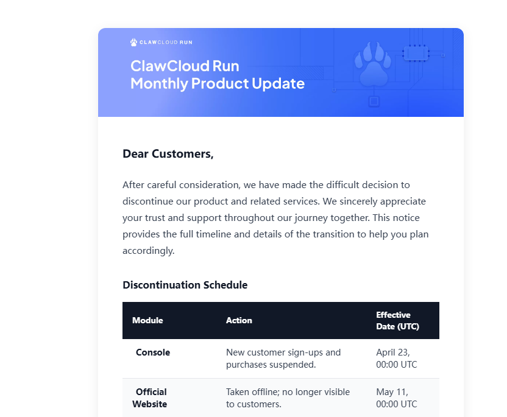

我之前发了一期视频和一篇文章来向大家介绍ClawCloudRun，我用了一年（在2025/4看零度的视频了解到的），然后就到26年4月介绍了一下白嫖ClawCloudRun。然后，我周五从学校回来看到评论区有人说跑路了，我还不信。然后，一翻邮件，天又塌了：

好好好，ClawCloudRun和Zeabur双双跑路，只剩下我们这些白嫖党在原地干瞪眼。

所以现在要想玩Docker或做全栈，还得自己买服务器或者玩限制超多的云函数。

所以...到最后还得是Vercel/Cloudflare/Edgeone/Netlify...