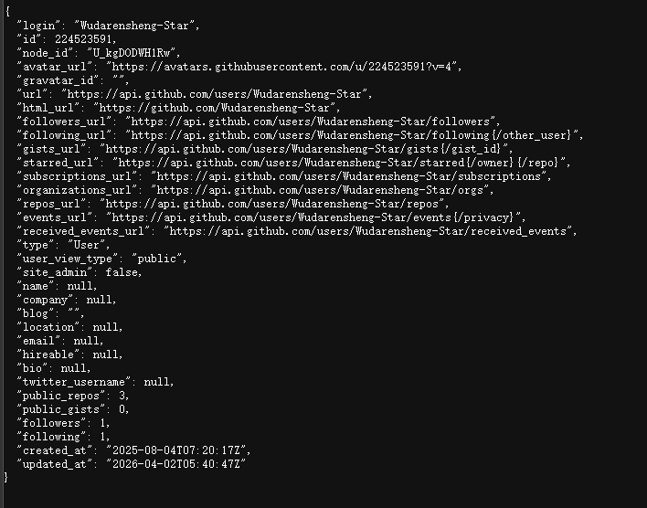
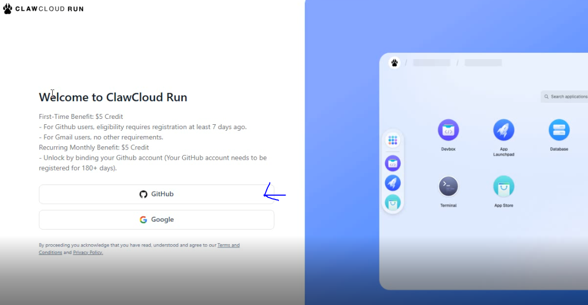
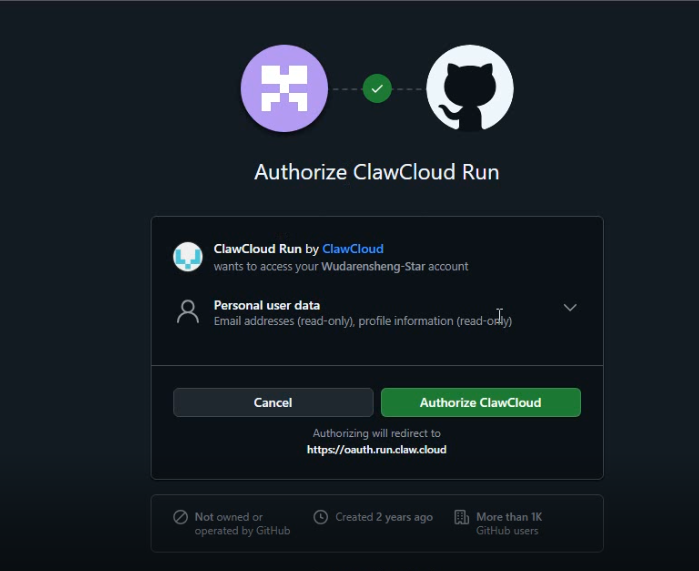
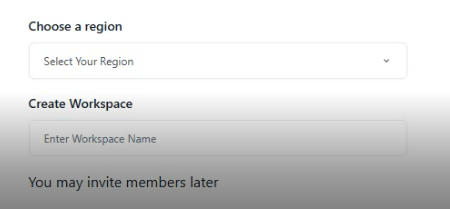
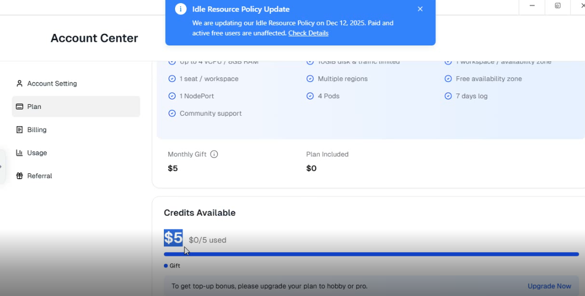

# 前言 

我一开始一直在用Claw Cloud Run，不过后来Claw Cloud Run出了新政策，每30天必须登录一次控制台，然后我就开始寻找替代品（我也是够懒）

然后某一天，我在看 @二叉树树 大佬的视频的时候，他提到了Zeabur，然后我就去试了一下，发现Zeabur所有账号每个月都有5刀的额度，并且计费比ClawCloudRun更灵活，于是我就把所有的服务都迁移了过去。

后面的事情大家都知道了，Zeabur停止了免费计划使用共享集群。虽然他们
说仍然运行在共享集群上的服务不会仍会保证继续运行，但我的Openlist和UptimeKuma仍然在3月8日这天被关了（真恶心啊😥）

虽然我的Openlist有替代品Onedrive Index，但这个是部署在Vercel上的，功能较少（特别少）。且又由于我长期没理那个玩意儿（那时我主要在用Openlist），我的数据库被Upstash删了（服了）。我的UptimeKuma的替代品UptimeFlare虽然是个好东西，但是那功能是真的少，且UI看着不美观，所以我也想把它换了。

总之我又滚回ClawCloudRun了（这是真香啊）


# 准备工作

1.一个注册时长超过180天的Github账号（最好）

2.一个脑子

3.一点动手能力

4.一个身份验证器（如1Password、Microsoft Authenticator，Bitwarden等）


# 确认Github账号注册时间
打开 https://api.github.com/users/{你的Github账号}  其中{你的Github账号}是你的Github账号用户名，找到created_at字段，就是你的注册时间。如图所示



# 注册账号
1.打开us-west-1.run.claw.cloud （run.claw.cloud炸了，也是够神的）

2.选择Github登录


3.同意Oauth授权


之后你就会来到这样的一个设置工作区（Workspace）的界面


4.这里有几点要注意
  ①region（区域）最好不要选新加坡和日本，这两个地区的IP基本都被墙了，且几乎已经爆炸（卡得要死），绑定自定义域名解析了1个星期还在Pending状态，绑好了后申请SSL证书又要等一个世纪。

  ②区域最好选美国西部，ip没被墙，使用还算正常，当然了延迟什么的都不说了，反正肯定比美国东部和欧洲低。

  ③Workspace Name（工作区名称）随便写，但是别用中文。


5.点击创建工作区，  

6.现在在账户中心的Plan里面应该就能看到你的5刀额度和Monthly Gift的每月5刀了，如图：


# 设置自动续期

Fork这个仓库

::github{repo="Kystor/auto-login-clawcloud"}

按照README开启2FA双重验证

:::warning
一定要妥善保管你的双重验证密钥！千万不能泄露和弄丢！
:::

:::important
请按照下方的步骤填写GH_2FA_SECRET这个变量
:::

接着把你的双重验证复制下来，大概是这样的格式
```
otpauth://totp/GitHub:{你的Github账号}?secret={你的双重验证密钥}&issuer={平台}
```

我们添加环境变量时只需要填写secret后的部分{你的双重验证密钥}，即可，其它的部分不要填，不然会报错。

填写完后打开Actions手动运行测试，测试通过后就什么都不用管了，之后每15天Actions都会自动运行一次。

# 结尾

视频教程