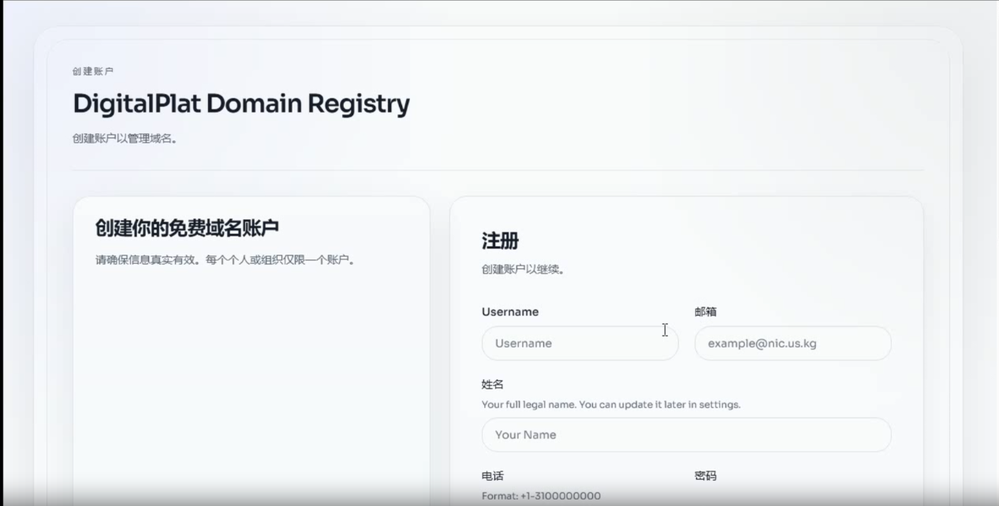
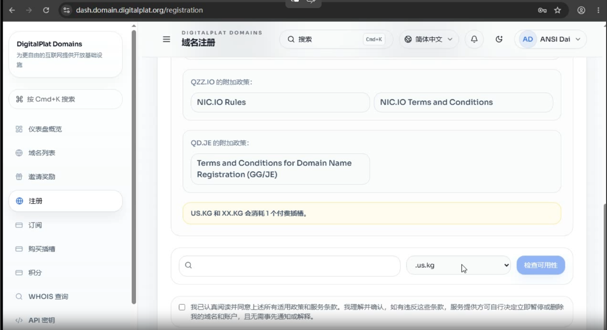
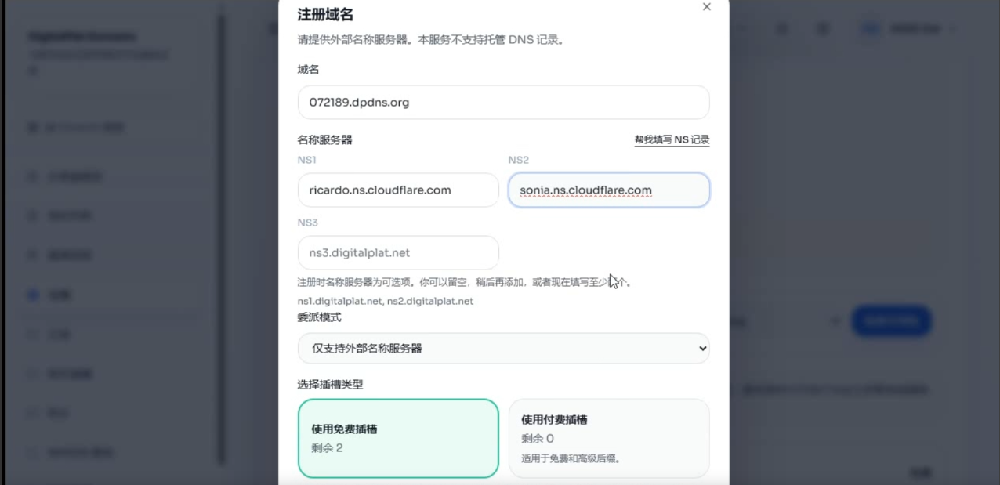

# 准备工作

一个邮箱
一个脑子

# 步骤

1.访问DigitalPlat Domain Dashboard

（用邀请码可以多一个域名）

不带AAF:  https://dash.domain.digitalplat.org/

2.注册账号

邮箱和用户名、密码自己设，我们重点看后面的信息填写

打开 https://meiguodizhi.com ，复制这些信息填回去，提交信息收验证码

3.需要Github Oauth作为验证，自己注册不讲(注册Github请前往https://github.com/)

4.来到控制台，找到侧边栏的注册，点进去，往下翻会让你同意协议和选择后缀，选择qzz.io，dpdns.org，qd.je

自己填一个可用的前缀，后缀目前只有qzz.io和dpdns.org可以托管到Cloudflare(Cloudflare账号请前往https://dash.cloudflare.com/)

然后会让你填以下NS服务器，自己去Cloudflare连接域名然后把NS服务器抄国内，如图所示（别照抄）

提交后等一会儿解析生效就可以回Cloudflare看看域名是否处于活动状态。

